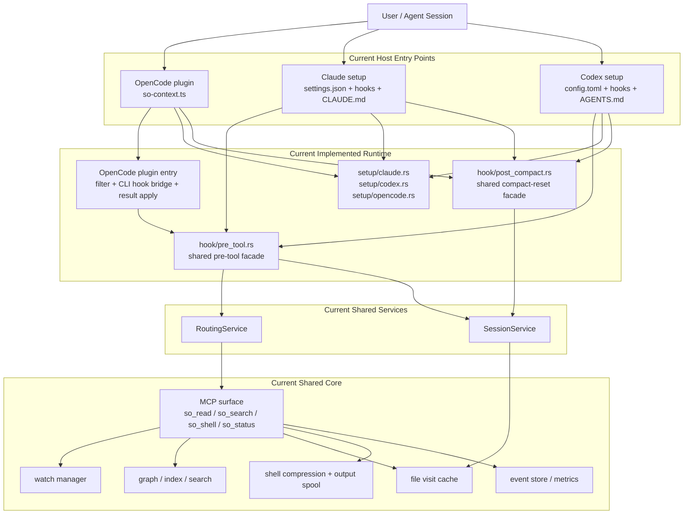
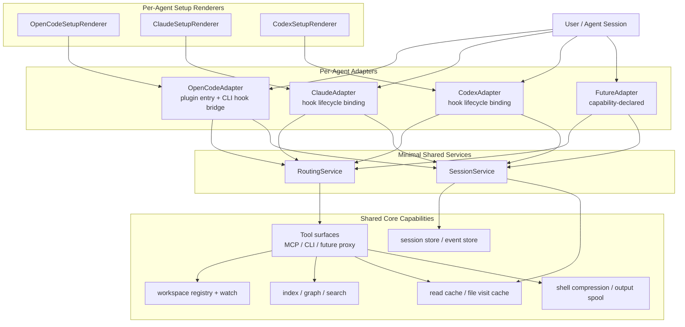

# Context Runtime Architecture

This document defines the re-architecture direction for `so-context`.

The goal is not to make the system more abstract for its own sake. The goal is
to make it safe to add:

- more agent hosts
- more host-native commands
- more lifecycle hooks
- future context features such as repeat-read dedupe, compact/resume state, and
  MCP transport optimization

without copying policy into every host-specific integration.

## Design Position

The architecture should be class/service oriented:

- each agent has its own adapter
- each agent has its own setup renderer and lifecycle binding
- shared context behavior lives in a very small set of reusable services
- shared core capabilities stay transport-agnostic

This is intentionally not a "large framework" design. The target shape should
stay small and boring.

## Current Architecture Interface Diagram

## Problems In The Current Shape

- Host entry points are intentionally different because each host exposes a
  different extension surface.
- OpenCode still needs a TypeScript plugin bridge to reach the shared Rust
  routing/session runtime.
- Setup code still owns host-specific matcher/config rendering and must stay
  disciplined to avoid policy drift.
- Compact/reset is implemented, but full resume hydration is still a later
  extension.
- Adding a new host is simpler than before, but still requires careful adapter
  and setup wiring rather than a zero-config plug-in model.

## Target Architecture Interface Diagram

## Core Architectural Rule

Each agent must have independent:

- setup rendering
- lifecycle binding
- session injection
- compact/resume handling
- host capability declaration

But they must not each re-implement:

- native command classification
- read/search/shell interception policy
- session identity rules
- compact/resume state rules
- shared tool contracts

## Class / Service Model

The smallest stable class-oriented model is:

### `AgentAdapter`

Owns host-specific behavior only:

- which lifecycle hooks exist
- how host identity fields are obtained
- which setup and instruction surfaces exist for that host
- how compact/resume events are surfaced

It must not own shared interception policy.

### `SetupRenderer`

Owns host config materialization only:

- MCP registration
- hook/plugin registration
- instruction file injection
- uninstall cleanup

It must not decide runtime policy.

### `RoutingService`

Owns shared routing decisions:

- whether to pass through a native tool
- whether to deny and reroute to a shared tool
- native alias classification
- how to normalize retry arguments
- how to produce stable user-facing retry guidance

### `SessionService`

Owns the first session continuity slice:

- session identity normalization
- event attribution
- cache reset after compaction
- future resume extension point

### Shared Instruction Templates

For the first refactor, shared rule/instruction content does not need a full
service. A shared template/module is enough.

### Shared Policy Artifact

For routing behavior, we should assume that not every host can call the same
runtime implementation directly.

Claude/Codex hook commands run through Rust.

OpenCode starts from a TypeScript plugin entry point, but forwards pre-tool
decisions into the shared Rust hook via CLI instead of owning an independent
host-only routing contract.

So the architecture should allow a shared policy artifact such as:

- shared metadata/constants
- generated matcher lists
- generated policy data
- generated retry / identity contract data

without requiring that every host execute the exact same code path.

## Compact / Resume Is Not `so_shell` Compression

These are different concerns:

- `so_shell` compression reduces one command's output payload.
- compact/resume preserves the runtime state of an agent session across context
  boundary events.

`so_shell` is output optimization.

compact/resume is session continuity.

They may both save tokens, but they must not share the same abstraction.

## Current Compact / Reset Contract

The current first-stage session continuity contract is compact/reset, not full
resume hydration.

Current compact/reset actions are:

- normalize host session identity through `SessionService`
- normalize host compact payload access through `AgentAdapter`
- derive `(connection_id, session_id)` best-effort when a host does not expose
  both
- send one explicit cache-reset control action to the daemon
- clear file-visit cache state for the compacted session before the next read

This means compact/reset already belongs to session continuity rules rather than
being treated as a shell or hook-specific trick.

## Degraded Continuity Behavior

Not every host exposes the same continuity surface.

The first migration therefore degrades explicitly:

- if a host exposes `session_id` but not `connection_id`, compact/reset falls
  back to `session_id` for both continuity slots
- if a host exposes no compact event, the architecture leaves continuity absent
  rather than inventing fake resume semantics
- if a host exposes no full resume hydration, compact/reset still works as a
  cache invalidation contract

This is intentional. Full resume is a later extension of the same session
capability family, not a prerequisite for the first migration.

## Identity Model

The new design must not reduce all identity to one opaque `session_id`.

Current hosts already expose different identity layers:

- session identity
- sub-agent or agent identity
- connection identity

The first migration should normalize these separately:

- `session_id`
  - the host session / conversation identity
- `agent_id`
  - the sub-agent or worker identity when the host exposes one
- `connection_id`
  - the transport or MCP connection identity when it differs from the session

The runtime may derive a `runtime_context_id` for internal use, but it should
not destroy the original identity layers.

## Current Capabilities Mapping

| Capability | Where it belongs in target architecture |
|---|---|
| Code graph indexing | Shared core |
| Incremental sync + multi-project watch | Shared core |
| Multi-agent auto-discovery | shared transport/core watch registry with session attribution support |
| Shell output compression | Shared core shell capability |
| Repeat-read deduplication | `SessionService` + cache strategy |
| Large-output FTS offloading | shared tool surface + shared core search |
| MCP tool description shrinking | tool-surface or instruction layer, later |
| MCP stdio transparent proxy | tool surface / transport layer, not host adapters |

## Extension Rules

When adding a new agent host:

1. Add a new `AgentAdapter`.
2. Add a matching `SetupRenderer` if the host needs install/uninstall support.
3. Declare host capabilities against the shared routing/session contract.
4. Reuse the existing `RoutingService`, `SessionService`, and shared core.

The default should be: new host, same runtime.

Not: new host, copy-pasted policy.

## Host Extension Surface

The minimal shared design must still leave room for host-specific lifecycle
surfaces that we are not using in phase 1.

Examples already exposed by current hosts include:

- session start / resume
- sub-agent start / stop
- post-tool review
- permission request interception
- prompt append / prompt transform
- pre-compact customization

The architecture should treat these as optional host extensions:

- not required for the first migration
- not ignored by the architecture
- attached to `AgentAdapter` capability declarations

This keeps the first implementation small without pretending these surfaces do
not exist.

## Non-Goals For This Refactor

- rewriting graph/index/search internals
- changing existing MCP tool contracts immediately
- bundling every future feature into the first migration
- introducing inheritance-heavy object hierarchies

## Migration Shape

The implementation refactor should proceed in this order:

1. Freeze the target architecture in docs/specs.
2. Introduce `AgentAdapter` and `SetupRenderer` boundaries without behavior change.
3. Move hook logic onto `RoutingService`.
4. Add compact/reset as an explicit `SessionService` concern.
5. Expand future capabilities behind the new boundaries.

This keeps the first code migration boring and reversible.
