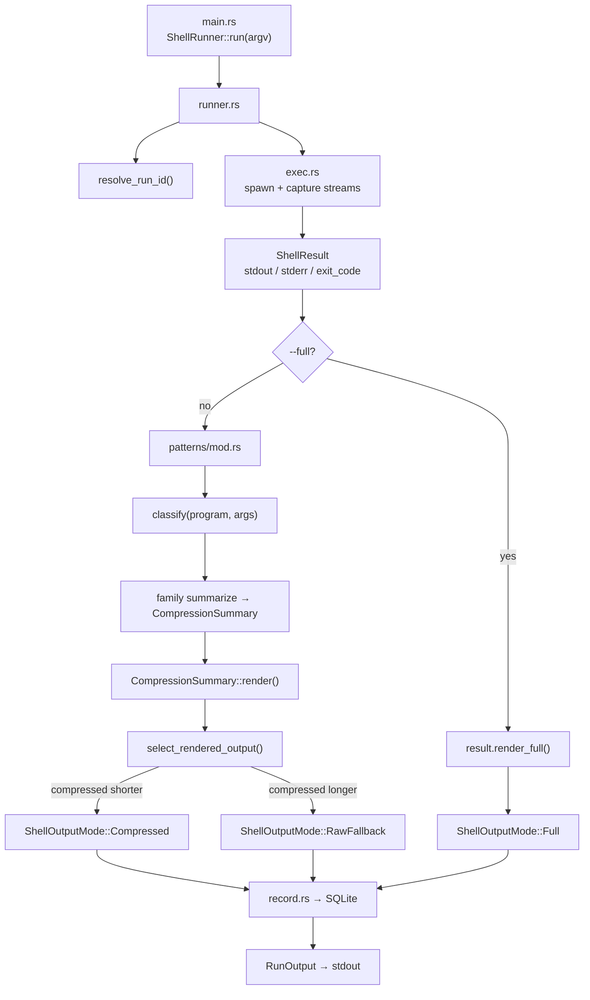

# Shell compression

| Doc | Purpose |
|-----|---------|
| [README.md](README.md) | Architecture and data flow (this file) |
| [support.md](support.md) | Supported commands matrix |
| [audit.md](audit.md) | Shell audit script and JSON report |

Deterministic shell output compression for AI agents. Commands run locally; stdout/stderr are classified, summarized, and printed in a shorter structured form unless `--full` is requested.

## CLI

```sh
so-context shell -- <command> [args...]
so-context shell --full -- <command> [args...]
```

Examples:

```sh
so-context shell -- ls -1
so-context shell -- git status
so-context shell --full -- cargo test
```

## Data flow



Compressed path in words:

1. Build `ShellInvocation` from `argv`.
2. Assign a `run_id` (env override or generated).
3. Execute the native command with size and time limits (`exec.rs`).
4. Classify the command into a `ShellPattern` (`patterns/mod.rs`).
5. Run the matching family summarizer to produce a `CompressionSummary`.
6. Render summary + detail lines to a string.
7. If the rendered text is not shorter than raw output, fall back to raw (`RawFallback`).
8. Persist metrics (bytes, pattern, render mode) to the events DB.
9. Return `RunOutput { rendered, exit_code }`.

## Module layout

```
src/shell/
├── mod.rs       Public surface: ShellRunner, ShellRunOptions
├── runner.rs    Orchestration: run → compress → select output → persist
├── exec.rs      Subprocess execution, timeouts, stream byte caps
├── types.rs     ShellInvocation, ShellResult, ShellPattern, CompressionSummary
├── record.rs    SQLite metrics per run (run_id, family, byte counts, render_mode)
└── patterns/    Per-family classify + summarize rules
    ├── mod.rs   Family handler table + classify/compress dispatch
    ├── argv.rs  Positional arg parsing (skip flags)
    ├── text.rs  Shared line/sample/truncate helpers
    ├── git/     git.*
    ├── docker/  docker.*
    ├── rust/    rust.cargo-*
    ├── node/    node.npm / pnpm / …
    ├── gh/      gh.pr / issue / run
    ├── k8s/     k8s.kubectl-*
    ├── build/   build.tsc / make / gradle / …
    └── generic/ generic.ls / find / rg / curl / …
```

## Core types

| Type | Role |
|------|------|
| `ShellInvocation` | `argv` (program + args) |
| `ShellResult` | Raw capture after execution |
| `ShellPattern` | Classified command family (e.g. `GitStatus`, `Ls`) |
| `CompressionSummary` | `summary` line + `details` list + stderr preview |
| `ShellOutputMode` | `compressed`, `raw_fallback`, or `full` |
| `RunOutput` | Final string printed to the agent + exit code |

Example compressed shape:

```text
entries=11; dirs=6; files=5
- artifacts/
- src/
- AGENTS.md
- ...
```

## Pattern dispatch

`patterns/mod.rs` registers families in order: git → docker → node → rust → gh → k8s → build → generic.

For each run:

1. **classify** — first handler whose `classify(program, args)` returns a `ShellPattern`.
2. **summarize** — that handler’s `summarize_pattern(result, pattern)`; on `None`, `generic::summarize_fallback`.

Unknown programs end up as `ShellPattern::Unknown` via `generic::summarize_unknown`.

## Execution limits

`exec.rs` defaults:

| Limit | Value |
|-------|--------|
| stdout | 10 MiB (truncated if larger; process still runs to completion) |
| stderr | 10 MiB |
| wall-clock timeout | 30s default (`SO_CONTEXT_SHELL_TIMEOUT_MS` to override) |

Truncation only affects how much output is kept in memory for compression. If the subprocess exceeds the timeout, `so-context` kills it, returns any captured partial output, and marks the run as timed out.

## Metrics

Shell execution is now recorded in the shared `events` table inside
`~/.local/share/so-context/events.db`.

- CLI `so-context shell` records a base `shell` event with CLI-scoped context.
- MCP `so_shell` records a `so_shell` event with full MCP client/session context.
- Event `params` include redacted `argv`, rendered mode, exit code, and byte counts.

Raw command output is not stored in SQLite; argv is redacted for secrets before persist.

## Related docs

- [support.md](support.md) — supported commands matrix (update when adding patterns)
- [audit.md](audit.md) — `scripts/shell_audit.sh` quality gate and JSON report

## Tests

```sh
cargo test shell
```

Pattern-level tests live next to implementations (`*_tests.rs`). Compare fixtures optionally via `scripts/compare_pattern_outputs.sh` (reference tooling, not the formal audit).
